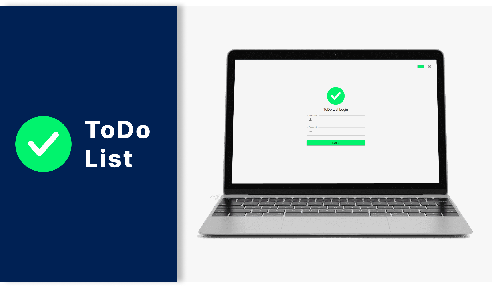

<h1 align="center">
  
</h1>

<h3 align="center">
  ✅ ToDo List
</h3>

Aplicação Web para lista de tarefas

<a href="#-sobre-o-projeto">Sobre o projeto</a> •
<a href="#-tecnologias">Tecnologias</a> •
<a href="#-layout-da-aplicação">Layout da aplicação</a>

## ✅ Sobre o projeto

Este projeto é um desafio técnico para desenvolvedor front-end. A proposta do mesmo foi construir uma interface para listagens de tarefas no estilo to-do list utilizando ReactJS, Vite e Material UI.

## 🎨 Layout da aplicação

Você pode ver o layout do projeto no Figma no link abaixo:

- [Layout Responsivo](https://www.figma.com/design/yjxRfWK721FS8hnYND9hIS/ToDo-List-Greenfy?node-id=14-52&t=AAhkdqAmmwqepBNd-1)

Lembrando que você precisa ter uma conta no [Figma](http://figma.com/) para poder acessar.

## 🚀 Tecnologias

Tecnologias que usei para desenvolver a aplicação:

- [ReactJS](https://pt-br.reactjs.org/)
  
- [Vite](https://vitejs.dev/)

- [TypeScript](https://www.typescriptlang.org/)
  
- [Material UI](https://mui.com/material-ui/)

## 🚀 Deploy da aplicação com Vercel

> https://todo-list-greenfy-em9i0c0m2-klayver-ximenes-projects.vercel.app
